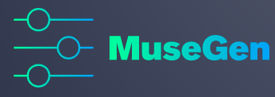

# Project MuseGen

Name : Iandro Rakotondrandria

Slides: https://docs.google.com/presentation/d/1U4tYJUlQxcFEqah7skJUkmbvPhk9vWX-lvCphylehXU/edit?usp=sharing

## Context 📇

This project was made by a team of 4 people, Kevin Goupil, Alexandre Rimbaut, Matrickx Parnas, and Iandro Rakotondrandria.

We are 4 different personalities but we are all passionate by music and we all wanted to use a deep learning model. So we naturally focused the project around AI music generation.

## Goals 🎯

The goal is to provide an AI based application that can genrate royalty free music based on theme, for creators.

## Local set up

**To set up locally**

1. RUN :
```shell
docker bild . -t musegen
```

```shell
docker run -it -v "$(pwd):/home/app" -e PORT=80 -p 4000:80 musegen
```

2. You should now be able to run your application locally by opening your browser and going to: `http://0.0.0.0:4000`


## Deliverables 📬

To complete this project, we produced:

* A presentation of the project :
    * in a Google Slide

* The source code of all elements necessary to build our infrastructure